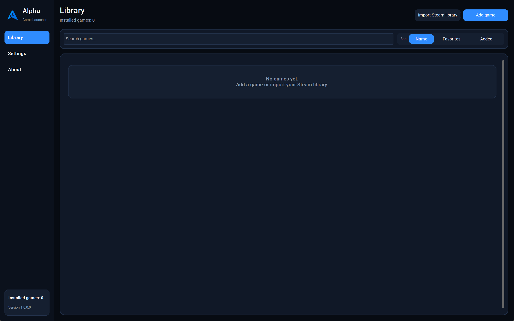
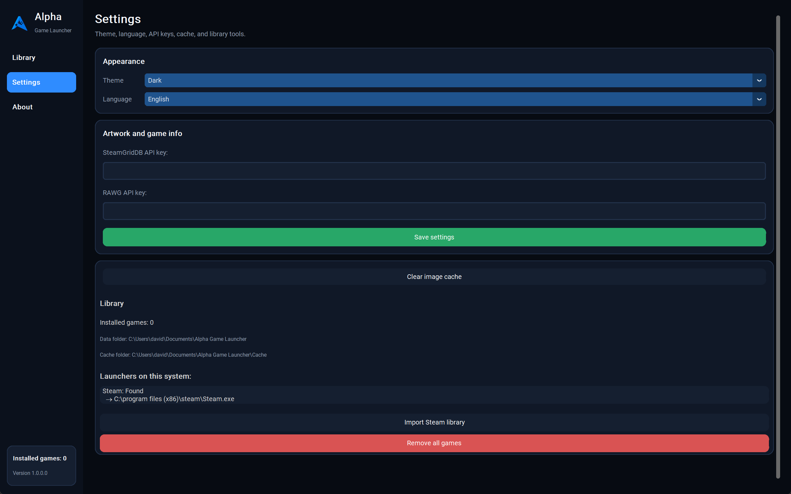
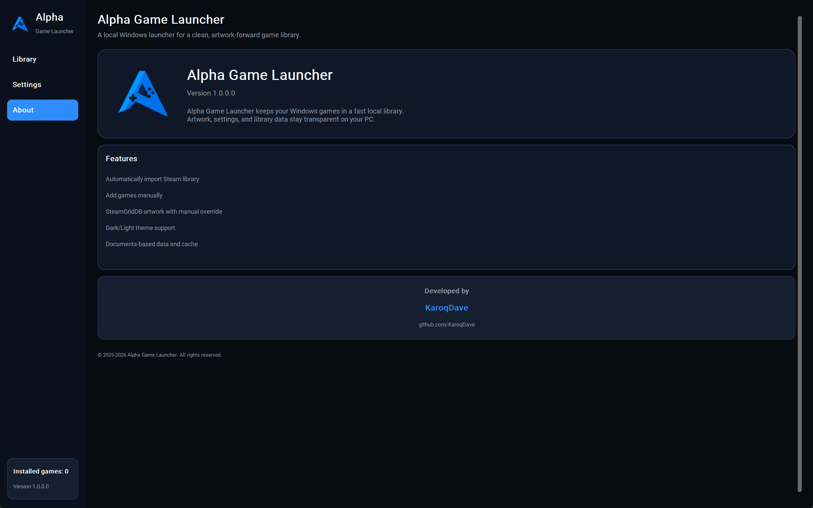

# Alpha Game Launcher v1.0.0.0

A local Windows game launcher built with Python and customtkinter.

Alpha Game Launcher keeps your PC game library clean, searchable, and local-first. It can import installed Steam games, add standalone `.exe` games manually, fetch artwork and game details through optional API keys, and store your library data transparently on your own machine.

## Screenshots







## Features

- Local Windows game library with a modern sidebar layout.
- Manual game adding for standalone `.exe` files.
- Steam library import from the local Steam installation.
- Searchable library with sorting by name, favorites, or added date.
- Favorite marking for games.
- One-click game launching.
- Artwork loading through SteamGridDB, with manual artwork override support.
- Optional RAWG game information for ratings, average playtime, and descriptions.
- Dark and light appearance modes.
- English and German UI language selection.
- Settings screen for theme, language, API keys, image cache, data folder, cache folder, and Steam detection.
- Local data storage in `Documents\Alpha Game Launcher`.
- Local image and artwork cache in `Documents\Alpha Game Launcher\Cache`.
- Clear image cache action from the app.
- About screen with current version, feature summary, and project credits.

## Requirements

- Windows 10 or Windows 11
- Python 3.10 or newer
- Dependencies listed in `requirements.txt`

Install dependencies:

```powershell
pip install -r requirements.txt
```

Run the launcher:

```powershell
python game_launcher.py
```

## Optional API Keys

Alpha Game Launcher works without API keys, but artwork and richer game information improve when keys are configured.

- SteamGridDB API key: used for online game artwork.
- RAWG API key: used for game information such as descriptions, ratings, and average playtime.

You can enter both keys in the Settings screen. The app can also read `STEAMGRIDDB_API_KEY` and `RAWG_API_KEY` from the environment.

## Data Locations

- Library and settings: `Documents\Alpha Game Launcher`
- Image and artwork cache: `Documents\Alpha Game Launcher\Cache`

## Roadmap

Version 1.0.0.0 completes the planned first release scope:

- Reworked Library, Settings, and About views.
- Steam library import.
- Manual game adding and launching.
- Search, favorites, and library sorting.
- SteamGridDB artwork support with manual artwork changes.
- RAWG game information support.
- Dark and light theme support.
- English and German UI language support.
- Local settings, library data, and image cache handling.

There is no public future roadmap yet.

## Author

Developed by [KaroqDave](https://github.com/KaroqDave).
